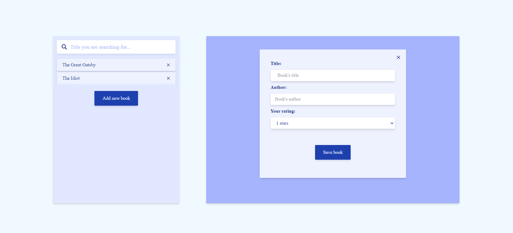
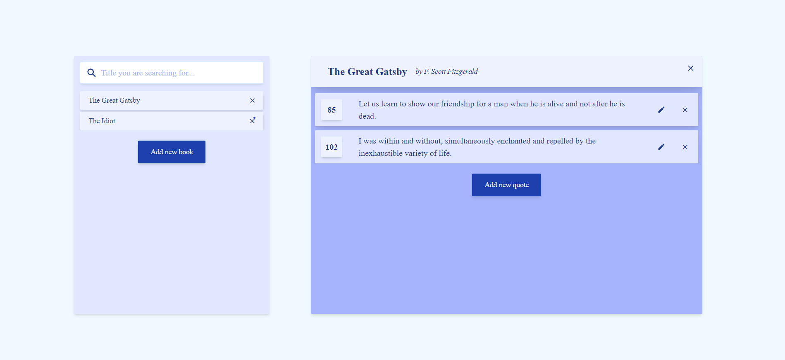
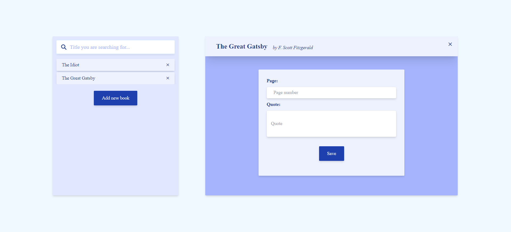

# quotes... App

## Description

This app was designed for all book lovers who want to save their read books and the most meaningful quotes they found during reading.
It has a user-friendly design which allows a nice user experience. The app is very intuitive and easy to use. It has 2 major features: books and quotes.
The user can easily save a new book, add a new quote, edit it and delete.
For now, all saved books or quotes are stored on a JSON file, which works as a simple data storage.
Getting the saved data, saving new books/quotes, editing quotes or deleting books/quotes are actions which are implemented by using fetch API on the JSON server.

#### The quotes... app was created in ReactJS using Vite.

## Future implementations and updates:

- modal windows for asking the user if they are sure about deleting data;
- relational database to store saved data;
- possibility to edit book's name and author;
- creating statistics based on the rating the book received and number of quotes;
- searching for specific query words or phrases through the saved quotes;
- categorizing the quotes based on their main topics or themes;
- sorting books alphabetically or by rating they have been given;
- adding information about the start and end reading dates;
- creating user accounts;
- etc...

## Installation Instructions

Run in the terminal

##### npm install

##### npm run server

##### npm run dev

## Demo

#### App start

#### Add new book form

#### Book overview

##### Add new quote form

## Acknowledgements

Following resources were used in developing the app:

- ReactJS + Vite;
- ReduxJS Toolkit;
- React Hook Form;
- React Icons
